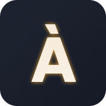

# My Portfolio

  

This is my personal portfolio website, showcasing my skills and projects. Built with React, Vite, and shadcn/ui, it features a clean and responsive design.

> 🔗 Project Link: [Portfolio](https://luelmo14.github.io/my-portfolio/)

## Contact

✉️ Email: [alexluelmo@gmail.com]

## Acknowledgements

🧾 This project uses the following:

- [Geist Font](https://vercel.com/font): Copyright (c) 2023 Vercel, in collaboration with basement.studio.  
  Licensed under the SIL Open Font License, Version 1.1 (http://scripts.sil.org/OFL)
- [Grainient](https://www.npmjs.com/package/@prodbyeagle/grainient): Used for creating gradient and grain effects. 
  Licensed under MIT.
- [Lucide React](https://lucide.dev/): Beautiful & consistent icon toolkit made by the community. 
  Licensed under ISC.
- [Shadcn/ui](https://ui.shadcn.com/): Beautifully designed components. 
  Licensed under MIT.
- [Tailwind CSS](https://tailwindcss.com/): A utility-first CSS framework. 
  Licensed under MIT.

&nbsp;&nbsp;&nbsp;&nbsp;_Note: This list includes key dependencies but is not exhaustive. The project uses additional open-source packages,_  
&nbsp;&nbsp;&nbsp;&nbsp;_each with its own license terms. For a complete list of dependencies, please refer to the `package.json` file._
